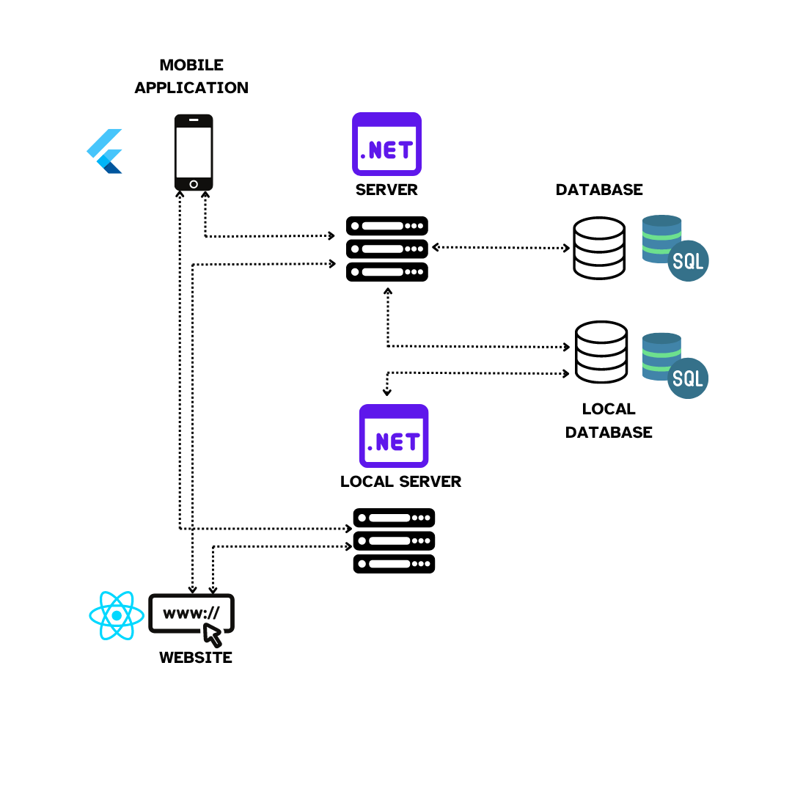

# Sprint 0 Worksheet (Group 8)

## Repositories
- Administration Repo: [admin](https://github.com/COMP-4350-Group-8/admin)
- Product Repo: [comp4350-project](https://github.com/COMP-4350-Group-8/comp4350-project)

## Presentation Proposal
- [Slides]([2024-09-20]PesentationPitch.pdf)
- [Slide Notes]([2024-09-20]PresentationPitchNotes.md)

## Summary & Vision
The ___Sail Mapper App___ will provide tracking and results for sailboats during races.
There will be two types of users, those that are participating in races, Racers, and those that are organizing and running the races, Race Committee (RC). RC will be able to create a race event and define a course for that race, Racers will be able to join this event.
The project will consist of a mobile app and a website. All Racer functions should be available through the app and all RC features should be available through the website. Racers will be able to initiate a track that will save their position, which will be available to RC, and other Racers in the race. The system should be able to function without an internet connection, the RC will be able to start an instance and Racers will be able to connect and share their track for the day.

### Core features
- Tracking of position, with the ability to share this track. (key feature 1)
- The ability to handle at least 7 tracks being uploaded by 150 users at the same time (key feature 1)
- Creation of race courses and attached race events. (key feature 2)
- The ability to create a local instance of the program so that full functionality is available without a greater internet connection. (key feature 3)
- Race result calculation will be available within the application (key feature 5) 

### Key Features - User Stories & Acceptance Criteria
- As a racer, I want to track my trip so that I can later save, view, and share my track. Tracking should be attachable to a race but it is not required. The tracks will all be stored on the local device and uploadable to the greater database. Since many racers can create many tracks and all connect back to the internet at the same time, the system should be able to handle the concurrent uploading of at least 7 tracks from 150 users at the same time. Tracks that are attached to the same race should be visible all together with the race course. 
  - _Acceptance criteria:_
    - As a user I open the app and am immediately able to start tracking a course. 
    - If I have joined a race that starts close to the time that I start tracking the app will prompt if this track is a part of that race. 
    - While tracking the app will show how long I have been tracking, how far I have gone, and my current speed. 
    - While tracking the app will have the option to stop tracking.
    - Once a track has been stopped if it was a part of a race, the app will attempt to upload that track to the server. If the server is not available, it will upload during the next connection. 
    - I should be able to attach my name, position, as well as boat name to an uploaded track
- As RC I want to set up races that define a course so that Racers can join and all the joined Racers tracks are visible in one place. Each course will have a start and finish line, as well as waypoints that must be rounded in specific directions and gates that must be passed. Each race course should have a shortest distance that is either measurable or automatically calculated. Several race courses can be grouped into a “Regatta” event. 
  - *Acceptance criteria:*
    - Racecourse creation should be available through the website. 
    - Race courses are a set of gates and turning marks that create a course, these can be placed on a map.
    - Any race course will have a minimum of two gates, defining a start line and finish line
    - Marks are one of two types, starboard or port roundings displayed in the corresponding green and red.
    - Each race course will also have a recommended path that also defines the course length. The recommended path will be a series of waypoints.
    - Once a race course has been created it should be able to be saved for later editing, or duplication
    - Saved race courses should be publishable for viewing and joining by Racers
    - Race courses can be selected and grouped into a regatta event  which is publishable all at once. 
- As RC I want to be able to start an instance of the backend so that if there is no greater internet connection racers can locally share their tracks. Later tracks can be uploaded for wider viewing either by RC or each Racer individually.
  - *Acceptance Criteria:*
    - All regular functionality should be available on a local network without any greater internet connection 
- As RC I want to be able to add notes to race events. Each course will have a written set of instructions that go with the mapped course, this set of instructions is visible to racers. The instructions could contain information other than just course details and could include PDF files.
  - *Acceptance Criteria:*
    - Within a mapped race there should be a section to add text notes and attach pdf files.
    - Notes are visible to racers alongside the mapped course.
- As RC I want the application to automatically calculate race results. The program should use the start time, along with the tracked time for a finish line to calculate the corrected time for each boat. The start and end times should both be editable by RC, as well as the handicap used to calculate the time for each boat.
  - *Acceptance Criteria:*
    - Once tracks are available for a race event the system should automatically calculate race results using the information available to the app. 
    - Start time is a variable that applies to all boats and is editable by RC
    - Finish time is unique to each boat and is editable by RC
- Racer locations connected to a race event should be uploaded and visible in real-time, with live update race position available to the racers.
  - *Acceptance Criteria:*
    - If an internet connection is available while tracking the app should upload tracks as each new GPS position.
    - All racer locations should be visible on the race map
    - The tracking page should include your current placement in the race and the difference  between you, the boat behind and the boat in front. 

## Initial Architecture
- Very high-level architecture of the project

- What technologies will be on each tier?
  - Front end
    - React (JavaScript) for web application
    - Flutter (Dart) for mobile application 
  - Back end
    - ASP.net (C#) for Server/Logic & API
    - SQL for Database
- Why will the architecture work?
  - __Data Synchronisation:__ 
    - ASP.net provides tools for Data Synchronisation which will help in syncing data between offline and online modes
  - __Easy Communication between Layers:__
    - ASP.NET helps in smooth communication between the frontend (React and Flutter) and the backend through easy RESTful API setup. Additionally, has powerful tools like Entity Framework which helps for a smooth SQL database interaction, simplifying data retrieval and storage. This ensures efficient, secure, and scalable communication throughout the architecture.
  - Simple and familiar to use
  - _[postPresentationAddition]_ __Separation of Concerns:__ 
    - React for the web interface,
    - Flutter for mobile UI,
    - ASP.NET Core for server-side logic and data processing, and,
    - SQL as the database layer.
    - *This approach allows each component to focus on its specific role, which improves efficiency in development, testing, and maintenance.*

## Work Division
- Project work is divided into 2 main categories,
  - __Specialized Work:__ is subdivided into roles with key responsibilities. This is done by holding specific members accountable for key responsibilities, reducing the chance of repeated and missing work. Project submission, server setup, and specific technology leads are all examples.
  - __General Work:__ is any task that can be worked on by any member. Implementing a new feature, debugging, and assisting others in their roles are all examples of what is expected from everyone.
> [!NOTE]
> Not all role responsibilities are solely that of the roles’ holder(s). At times some members will need to take on other roles' responsibilities. If a member’s workload is noticeably less than that of another member's workload, they are expected to reach out and help distribute the work. *examples,*
> - A responsibility only one role states, but every member should try to fulfil:
>   - Keeping meetings on track
> - Example of a responsibility solely that of the role's holder(s): (assuming the role holder(s) were not informed)
>   - Submitting project files for grading
> 
> _In general_, if fulfilling another role's responsibility does not confuse or hinder the role holder's ability to work. Then it is safe to fulfill without asking.
- A list of Roles & Responsibilities can be [found here](https://github.com/COMP-4350-Group-8/admin/blob/main/role-responsibilities.md)
- GitHub Issues are used to record work

